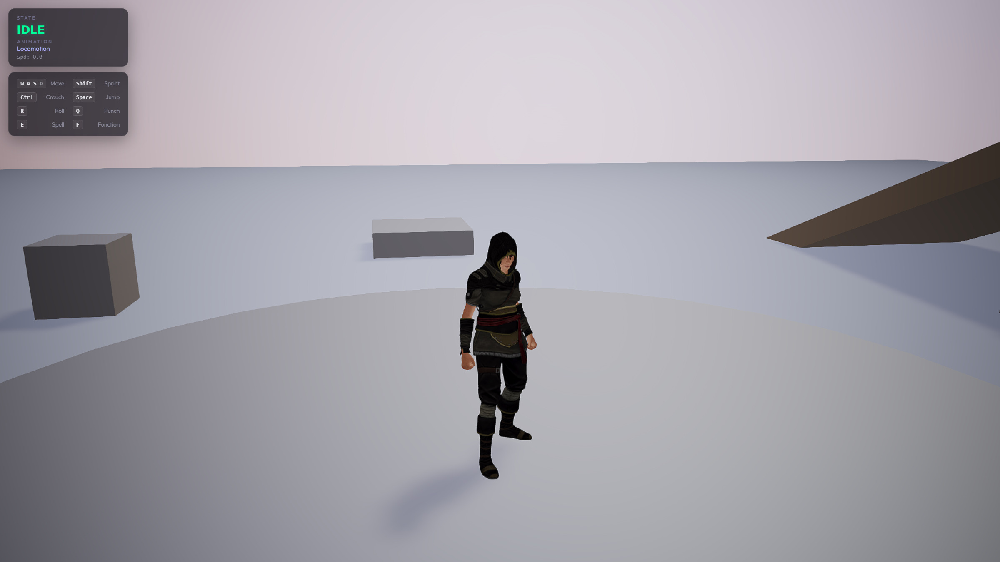

# 🎮 3D Character Animation Controller V2 for Babylon.js

An advanced third-person character locomotion and physics framework built with **Babylon.js**. **The primary goal of this framework is to provide a highly powerful, fluid, and extremely easy-to-use Character Controller** that integrates out-of-the-box physics, animations, and high-end visual features.

🎮 **Live Demo**: [https://viseni.com/_demos_/bjs_character_controller_v2/](https://viseni.com/_demos_/bjs_character_controller_v2/)



> If this tool saves you time, consider supporting its development! Every coffee keeps the rays casting. ☕
>
> <a href="https://www.buymeacoffee.com/drlerian" target="_blank"></a>

---

## 🚀 Key Features & Engine Mechanics

*   **Centralized Configuration (`DEFAULT_CHAR_CONFIG`)**: All customizable settings (key bindings, movement physics, mobile touch layouts) are centralized in a beautifully documented configuration block at the very top of `character-controller.js`.
*   **Locomotion Blend Tree (Reactive Animations)**: Smoothly blends weight and speeds between `Idle_Loop`, `Walk_Loop`, and `Sprint_Loop` using a lerped visual velocity tracking filter for premium fluid weight changes.
*   **Functional Rotation Tuning (`ROT_SPD`)**: The rotation speed setting is fully integrated into the update loop, offering responsive yaw adjustments that scale smoothly from grounded to airborne (50% reduction in mid-air).
*   **Dual-State Coexistence**: Crouch and Sprint operate as persistent **Toggles (Latch Mode)** and can cohabitate seamlessly, allowing a high-speed **Crouch Run (Agachado)** locomotion state.
*   **Advanced Kinetic Camera System**:
    *   **Natural Lerped Follow**: Smoothly tracks the character's height using adaptive linear interpolation (Lerp), eliminating rigid camera cuts and stutter.
    *   **Dynamic Tunnel Vision (FOV Expansion)**: Automatically expands the camera Field of View (FOV) at higher velocities to increase the sensation of speed. Fully toggleable (`DYNAMIC_FOV`) with fine-tunable limits (`DYNAMIC_FOV_MAX`).
    *   **Landing Impact Camera Shake**: Triggers multi-axis rotational camera shake depending on landing height and landing physics velocity.
    *   **Mobile-Adaptive Framing & Recenter**: Lowers the target center on mobile to keep the character perfectly visible above thumbs and touch overlays, supporting seamless screen double-tap (and desktop double-click) recenter transitions.
    *   **Camera Follow Lock (`CAM_FOLLOW_LOCK`)**: A customizable setting that locks the camera angle directly behind the character's facing direction at all times (locking horizontal alpha, vertical overview beta to a perfect `60°` pitch, and radius zoom distance). When active, it automatically transitions the locomotion to a classic **Direct Steering Action Control (Tank Controls)**: W/S moves the player locally along their heading direction while A/D directly rotates the character yaw (turning the camera with it), eliminating all camera jitter.
    *   **Dynamic Zoom & HUD Sync**: The camera follow distance (`CAM_FOLLOW_DIST`) and the HUD slider are fully synchronized in real-time. Any zoom inputs (mouse wheel, trackpad scrolls, or mobile multi-touch pinch gestures) directly update the follow distance, saving the value to `localStorage` and updating the UI automatically. To prevent physical movement and collision adjustments from causing camera distance drift, sync is intelligently restricted to periods of active user zoom interaction.
*   **Procedural Footstep Particles**: Generates dynamic dust trails at the feet during locomotion, with impactful landing bursts based on fall velocity.
*   **Advanced Visual Suspension & Slope Alignment**:
    *   **Y-Suspension & Morphing**: Dampens vertical height shocks when walking up/down steps. Automatically morphs collision bounds and visual offsets during standing actions (magics, interactions) when crouched.
    *   **Dynamic Slope Alignment (Pitch Tilt)**: Automatically projects the ground normal relative to the character's forward direction to tilt the body pitch angle (leaning forward when climbing up, backward when descending) during both movement and standstill, resolving floating visual lag.
    *   **Leaning & Banking**: Automatically pitches forward on acceleration, backward on braking, and banks into sharp angular turns.
    *   **Squash & Stretch**: Elastic scale distortions on jumps, falls, and landing impact.
*   **Ledge Snap & Stairs Snapping**: Downward snap pressure prevents micro-airborne jitter on ramps and stairs, optimized with custom platform and floor naming filters for perfect grounding.
*   **Single-Step Climbing Animation**: Automatically detects when the character climbs over a single step/obstacle (rather than stairs or ramps) and briefly plays a low-weight `JUMP_LAND` animation to simulate a natural and realistic step-up impulse.
*   **Smart Landing Physics & Height Filtering**: Evaluates vertical impact velocity (`jumpVel < -3.0`) and tracks peak airborne height to calculate the exact physical drop distance (`fallHeight > 0.4m`). This allows the controller to ignore tiny stair drops or curbs while perfectly triggering the landing animation (`Jump_Land`) and visual squash effects on real falls and jumps. The execution order resolves calculations *before* grounded state resets, ensuring perfect precision.
*   **Bulletproof Dodge Roll Timer**: The `ROLL` animation state transitions flawlessly to walking/running upon landing using a precise 700ms JavaScript timing clock, ensuring the roll is never cut off or interrupted by landing physics.
*   **Advanced Double Jump Mechanics**: Allows the character to perform a double jump in mid-air (`_doubleJump`). This features full directional momentum redirection at the moment of the second takeoff, even when air control is disabled. It can be toggled on/off directly from a dedicated HUD switch and persists across page reloads.
*   **Ceiling Roll Protection & Auto-Uncrouch**: Block rolls if crouching under low ceilings, preventing glitching through obstacles. If a roll ends under a low ceiling, the character is safely forced into the crouching state, and will automatically stand up (auto-uncrouch) as soon as they emerge into an open area.
*   **Dynamic Collision Width Adjustments**: Widens the capsule ellipsoid radius (X/Z) from `0.35m` to `0.65m` when sprinting to prevent the head and body meshes from clipping into walls and low obstacles when leaning forward at high speeds.
*   **HUD Click Autofocus Release (Blur)**: Implements immediate focus release (`blur()`) on all HUD interactive buttons, checkboxes, and sliders upon click or change, immediately returning focus to the Babylon canvas. This completely prevents the Spacebar key (Jump) from accidentally toggling HUD elements.
*   **Customizable Air Control Setting**: A toggleable HUD switch is available to enable/disable mid-air steering. When disabled (`AIR_CONTROL: false`), the player's flight trajectory is locked to their takeoff momentum in both standard and camera follow lock locomotion styles.
*   **High-End HUD & Mobile Touch UI**: Fully custom glassmorphism virtual joystick and responsive action buttons.
    *   **Integrated Collapsing panel**: Double-click/tap on canvas recenters camera seamlessly. The HUD collapses into a compact glowing glass bead in the screen corner and persists its state via `localStorage`.
    *   **Real-time HUD Settings Switches**: Integrated interactive tactile glassmorphism switches inside the main HUD panel to toggle `Camera Follow Lock`, `Dynamic FOV`, `Double Jump`, and `Air Control` in real time, plus a high-precision slider to dynamically scale `Max FOV Intensity` (from `0.00` to `1.00`) with instant hot-reload feedback.

---

## 🕹️ Controls Layout

### Keyboard & Mouse (PC):
*   `W`, `A`, `S`, `D` / `Arrow Keys`: Camera-relative movement.
*   `Shift`: Sprint (Persistent Toggle / Latch Mode button).
*   `Ctrl`: Crouch (Persistent Toggle / Latch Mode button; blocked under ceilings).
*   `Space`: Jump & Double Jump (1st press: standard jump. While in mid-air: 2nd press executes a Double Jump with full directional redirection; 3rd press queues a landing dodge-roll recovery. If double jump is disabled, pressing a 2nd time in mid-air queues the landing roll).
*   `R`: Dodge roll (Horizontal momentum; blocked when crouching under low ceilings/obstacles).
*   `Q`: Punch.
*   `E`: Spell casting (Automatic stand-up when crouched).
*   `F`: Interaction (Automatic stand-up when crouched).
*   `Mouse Drag`: Orbit camera.

### Mobile Touch Layout:
*   **Left Hand**: Floating Analog Joystick (drag to adjust speed/animations dynamically).
*   **Screen Double-Tap**: Smoothly recenter camera behind the character.
*   **Right Hand (Button Grid)**:
    *   **Row 1 (Upper)**: `SPELL` · `ACT` · `CROUCH` (Latch Mode toggle with visual active glow indicator)
    *   **Row 2 (Lower)**: `ROLL` · `SPRINT` (Latch Mode toggle with visual active glow indicator) · `JUMP`

---

## 🛠️ Implementation Quickstart

The core architecture consists of modular script components:
1.  **`AnimCtrl` & `CharCtrl`** ([js/character-controller.js](js/character-controller.js)): Handles skeletal animations cross-fades, virtual groups, inputs, collision physics, and procedural locomotion visuals.
2.  **`Custom HUD (Optional)`** ([js/custom-hud.js](js/custom-hud.js)): Dynamically inserts and manages the glassmorphism HUD, setting sliders/toggles, and the FPS monitor overlay.
3.  **`Custom Pointer (Optional)`** ([js/custom-pointer.js](js/custom-pointer.js)): Implements a synchronized custom canvas cursor (dot + expanding ring) that adapts dynamically to interactive elements.

### Canonical Setup Reference:
For a fully detailed, fully-commented production implementation, refer to the `loadCharacter` function inside [js/app.js](js/app.js). 

It outlines the exact production steps to:
*   Import the animated GLB model asynchronously.
*   Configure materials, shadow-casting properties, and raycast pickability.
*   Instantiate the parent physical capsule collider mesh (`playerCapsule`) with correct ellipsoids and collision attributes.
*   Parent the visual character rig to the collider with proper height alignments.
*   Filter out raw animation sets and instantiate the `AnimCtrl` and `CharCtrl` controllers.
*   Establish camera target-follow behavior with custom offsets tailored for desktop and mobile thumbs clearance.

## 🔄 Animation Pipeline & Rig Correction

This framework is designed around a 3D character from **Mixamo** retargeted with high-quality animations from the **Universal Animation Library by Quaternius**.

### 📦 All-in-One Embedded Assets
To achieve optimal loading performance and zero-overhead network delivery, the final asset (`character_animated.glb`) packages **both the 3D character mesh and all skeletal animations embedded inside a single, highly compressed file**. This makes the asset extremely easy to distribute, load, and manage inside your Babylon.js scene.

### 🛠️ Merging Animations (`merge_animations.mjs`)
You can use the local script [js/merge_animations.mjs](js/merge_animations.mjs) to retarget and blend skeletal animations from external GLB files (e.g., Mixamo or Blender animations) directly onto your character model:

```bash
# Install tool dependencies
npm install fs-extra @gltf-transform/core @gltf-transform/extensions @gltf-transform/functions draco3dgltf

# Run the merging utility
node js/merge_animations.mjs -c base_character.glb -a animations.glb -o assets/character_animated.glb
```

### ⚡ Advanced Automated Pipeline: FBX2GLB
For a fully automated and advanced asset workflow, you can use **FBX2GLB-Batch-Convert-Optimizer**, an advanced batch converter and optimizer utility. It handles converting FBX characters and animations directly to GLB, optimizing textures/geometry, and automatically merging them into a single consolidated file:

👉 **GitHub Repository**: [FBX2GLB-Batch-Convert-Optimizer](https://github.com/crazyramirez/FBX2GLB-Batch-Convert-Optimizer)

This utility allows you to easily convert FBX folders, apply Draco mesh compression, bake textures, and automatically run the `merge_animations` script in a single-command batch pipeline.

---

## 📚 Credits & Attributions
*   **Character Rig**: Customized **Mixamo** skeletal rig.
*   **Animations**: Built using the [Universal Animation Library by Quaternius](https://quaternius.com/packs/universalanimationlibrary.html).

---

## 📄 License
This project is licensed under the **MIT License** - see the [LICENSE](file:///d:/DEV/BJS%20Character%20Controller%20V2/LICENSE) file for details.

> [!IMPORTANT]
> You are free to use, modify, and distribute this software for personal and commercial projects, provided that you keep the original copyright notice and attribute the authorship of the Character Controller to **Diego Ramirez (https://github.com/crazyramirez)** in all copies or substantial portions of the software.


