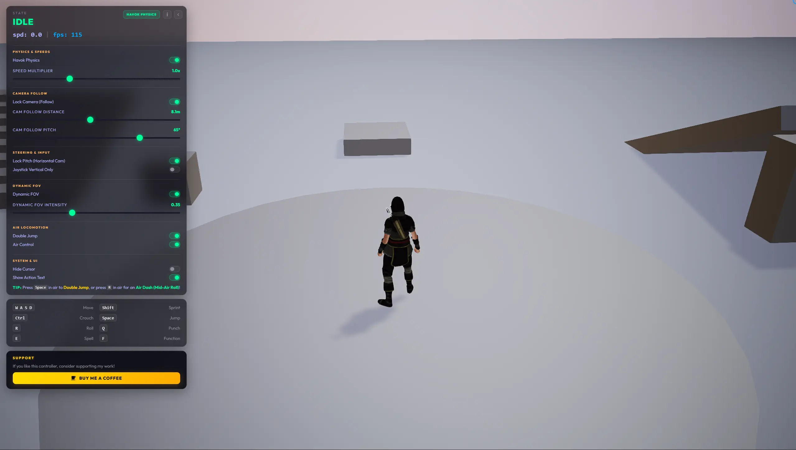
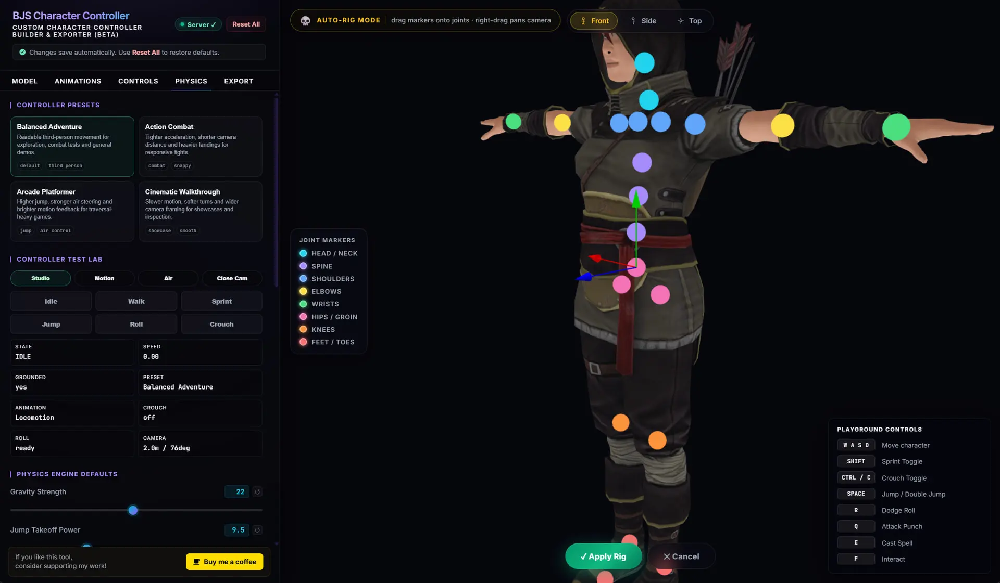

# 🎮 3D Character Animation Controller V2 for Babylon.js

An advanced third-person character locomotion and physics framework built with **Babylon.js**. This framework provides a fluid, powerful, and easy-to-use Character Controller with integrated physics, animations, and high-end visual features.

🎮 **Live Demo**: [https://viseni.com/_demos_/bjs_character_controller_v2/](https://viseni.com/_demos_/bjs_character_controller_v2/)



> ☕ If this controller saves you time, consider supporting its development!
>
> <a href="https://www.buymeacoffee.com/drlerian" target="_blank"></a>

---

## 🚀 Key Features

*   **Dual-Movement Modes (Physics vs Kinematic)**: Toggle dynamically between Havok Physics (dynamic simulation with body bodies) and standard Kinematic Collisions (ellipsoid-based movement) directly from the HUD.
*   **Locomotion Blend Tree**: Smoothly blends weight and speed between Idle, Walk, and Sprint.
*   **Dual-State Toggle Coexistence**: Crouch and Sprint operate as persistent toggles and can co-exist (allowing crouch-running).
*   **Dynamic Zoom & Camera Follow**: Smooth camera tracking with automated user-zoom sync (mouse wheel, trackpad, pinch) and double-tap recentering.
*   **Dynamic FOV & Camera Shake**: Camera Field of View expands with speed. Rotational camera shake is triggered on landing impacts relative to fall height.
*   **Camera Follow Lock (Direct Steering)**: Locks the camera directly behind the character for tank-style direct controls.
*   **Visual Enhancements**: Procedural dust/smoke trails at the feet, procedural leaning/banking on turns, slope-incline alignment, and squash & stretch scaling.
*   **Collision height adjustments & Ceiling protection**: Shrinks the capsule automatically when crouching/rolling, prevents standing up or rolling under low ceilings, and expands width when sprinting to prevent wall clipping.
*   **Ledge & Stairs Snapping**: Keeps the character grounded on sloped surfaces and stairs to prevent airborne jitter.
*   **Slope-Aligned Kinematic Traversal**: Kinematic collisions mode projects movement directly onto the ground normal to ensure butter-smooth ascent/descent on ramps and slopes.
*   **Smart Snap-Down Controls**: Dynamically disables downward snap forces when ascending stairs or steep slopes to eliminate physics/collision jitter.
*   **Implicit Self-Collision Prevention**: Prevents parent-capsule jitter by automatically disabling collision checks (`checkCollisions = false`) on imported character visual meshes.
*   **Mobile Touch Support**: Responsive virtual joystick and customizable glassmorphism action buttons.
*   **Air Dash (Mid-Air Roll)**: Perform a responsive dodge roll in mid-air with a horizontal speed boost and a 55% jump-power vertical hop (available if Double Jump is enabled, works even after double jumping).
*   **Action Interrupt Roll**: Pressing Roll immediately interrupts active attack combos or spell casts for instant responsiveness.
*   **Roll Cooldown & HUD Feedback**: A 1.1s cooldown prevents roll spamming, displaying a "DODGE COOLDOWN" HUD warning when pressed too early.
*   **Toggleable Action HUD Texts**: Toggle on-screen action text alerts (like "AIR DASH", "JAB", "CROSS!") directly from the System & UI settings drawer.

---

## ⚖️ Physics vs. Kinematic Modes

`character-controller.js` is a **unified single-file engine** that runs in two distinct physics regimes. Both modes live in the same class — a single `usePhysics` flag switches the internal code paths at initialization time.

*   **Havok Physics (Default)**: Leverages the WASM-powered **Havok Physics** engine. The character capsule is created as a dynamic `PhysicsBody` with defined mass and inertia properties, interacting naturally with other dynamic aggregates (like boxes, cylinders, and triggers).
*   **Kinematic Collisions**: Runs entirely within Babylon's native collision engine using kinematic ellipsoids (`moveWithCollisions`). Havok initialization is skipped entirely, providing maximum performance and deterministic locomotion.

### Automatic detection (default behaviour)

The engine **auto-detects** on every load. No configuration required:

| `localStorage('use-physics')` | Result |
|---|---|
| not set | Try Havok → success: physics mode. Fail: kinematic silently. |
| `'true'` (HUD forced ON) | Try Havok → success: physics mode. Fail: kinematic + clears override. |
| `'false'` (HUD forced OFF) | Kinematic always, skips Havok init entirely. |

### Overriding the mode

**HUD toggle** — easiest. Saves to `localStorage` and reloads. Clears itself automatically if Havok fails to load.

**Programmatic override via `localStorage`:**
```javascript
localStorage.setItem('use-physics', 'false'); // force kinematic
localStorage.setItem('use-physics', 'true');  // force Havok (falls back if unavailable)
localStorage.removeItem('use-physics');        // back to auto-detect
// reload required for change to take effect
window.location.reload();
```

**Direct constructor option** (bypasses localStorage, for embedded use):
```javascript
const charCtrl = new CharCtrl(playerCapsule, charRoot, camera, animCtrl, scene, {
  usePhysics: true,  // or false
  config: {
    SPEED_MULTIPLIER: 1.5 // Multiplies walking, running and jogging speeds
  }
});
```

---

## ⚙️ Configuration Parameters

The `config` object in the constructor accepts a wide range of physics, camera, and gameplay properties to fine-tune character behavior:

| Parameter | Default | Type | Description |
|---|---|---|---|
| `GRAV` | `22` | *number* | Gravity force pulling the character down |
| `JUMP_PWR` | `9.5` | *number* | Vertical takeoff impulse force for jumping |
| `SPD_WALK` | `2.5` | *number* | Maximum physical walking speed |
| `SPD_JOG` | `3.0` | *number* | Maximum physical jogging speed (blend speed threshold) |
| `SPD_SPRINT` | `5.0` | *number* | Maximum physical sprinting speed |
| `SPD_CROUCH` | `2.0` | *number* | Maximum physical crouching walk speed |
| `SPD_CROUCH_RUN` | `3.2` | *number* | Maximum physical crouching run speed |
| `ACCEL` | `14` | *number* | Movement acceleration rate (speed-up responsiveness) |
| `DECEL` | `16` | *number* | Movement deceleration rate (braking/stopping responsiveness) |
| `ROT_SPD` | `40` | *number* | Character yaw rotation speed responsiveness |
| `AIR_CONTROL` | `false` | *boolean* | Steering control in mid-air (true = full control, false = no control) |
| `DYNAMIC_FOV` | `true` | *boolean* | Dynamically adjust camera Field of View based on speed |
| `DYNAMIC_FOV_MAX` | `0.10` | *number* | Maximum camera FOV expansion amount at full sprint speed |
| `CAM_FOLLOW_LOCK` | `true` | *boolean* | If true, the camera is locked behind the character's facing direction |
| `CAM_FOLLOW_PITCH` | `1.047` | *number* | Camera follow lock pitch (beta angle in radians, approx 60 degrees) |
| `CAM_FOLLOW_DIST` | `8.0` | *number* | Camera follow lock distance (radius in meters) |
| `CAM_LOCK_PITCH` | `false` | *boolean* | If true, drag input only rotates camera horizontally (locks pitch axis) |
| `JOYSTICK_LOCK_X` | `false` | *boolean* | If true, joystick input is locked to vertical axis only (no strafing) |
| `DOUBLE_JUMP_ENABLED` | `true` | *boolean* | If true, the character can perform a double jump in mid-air |
| `SPEED_MULTIPLIER` | `1.0` | *number* | Speed multiplier for walking, running, and jogging |
| `PLAY_PARTICLES` | `true` | *boolean* | Play procedural dust/smoke particles under the character's feet |

---

## 🔄 Dynamic Animation Remapping

You can dynamically change any animation on the character controller or adjust keyframe ranges at runtime using the `AnimCtrl` instance (accessed via `charCtrl.anim`):

### 1. Reassigning Animations (Setters)
Pass a new Babylon `AnimationGroup` to dynamically swap any of the pre-mapped animations:

```javascript
// Remap basic locomotion
charCtrl.anim.setWalkAnim(newWalkAnimGroup);
charCtrl.anim.setRunAnim(newRunAnimGroup);
charCtrl.anim.setIdleAnim(newIdleAnimGroup);

// Remap crouch states
charCtrl.anim.setCrouchIdleAnim(newCrouchIdle);
charCtrl.anim.setCrouchFwdAnim(newCrouchWalk);

// Remap jumps and actions
charCtrl.anim.setJumpStartAnim(newJumpStart);
charCtrl.anim.setJumpLoopAnim(newJumpLoop);
charCtrl.anim.setJumpLandAnim(newJumpLand);
charCtrl.anim.setRollAnim(newRoll);
charCtrl.anim.setPunchJabAnim(newPunchJab);
charCtrl.anim.setPunchCrossAnim(newPunchCross);
charCtrl.anim.setSpellEnterAnim(newSpellEnter);
charCtrl.anim.setSpellShootAnim(newSpellShoot);
charCtrl.anim.setSpellExitAnim(newSpellExit);
charCtrl.anim.setInteractAnim(newInteract);

// Remap any custom animation key
charCtrl.anim.setAnimation('Custom_State_Name', myAnimGroup);
```

### 2. Modifying Playback Keyframe Ranges
Change the start/end frames of an animation without replacing the group:
```javascript
// setAnimationRanges(animKey, startFrame, endFrame)
charCtrl.anim.setAnimationRanges('Walk_Loop', 10, 45);
```

---

## 🕹️ Controls Layout

### Keyboard (PC):
*   `W`, `A`, `S`, `D` / `Arrow Keys`: Movement.
*   `Shift`: Sprint (Toggle).
*   `Ctrl`: Crouch (Toggle).
*   `Space`: Jump / Double Jump.
*   `R`: Dodge roll / Air Dash:
    *   **Action Interrupt:** Instantly cancels active attack combos or spell casts.
    *   **Roll Cooldown:** 1.1s cooldown between rolls (triggers a "DODGE COOLDOWN" HUD alert).
    *   **Air Dash:** If Double Jump is enabled in settings, performs a mid-air roll with a horizontal boost and a 55% jump-power vertical hop (usable even after double jumping).
*   `Q`: Punch combo.
*   `E`: Spell casting.
*   `F`: Interaction.
*   `Mouse Drag`: Orbit camera / Double-click to recenter.

### Mobile Touch:
*   **Left Hand**: Floating Analog Joystick.
*   **Right Hand (Buttons)**: `SPELL`, `ACT`, `CROUCH`, `ROLL`, `SPRINT`, `JUMP`.
*   **Canvas Double-Tap**: Recenter camera.

---

## 🛠️ Implementation Quickstart

The `js/` directory is organized into subfolders by role:

- **`js/character-controller.js`** — Unified core engine. Handles Havok Physics and Kinematic modes, locomotion state machines, and animation blending. Exports `initPhysics` and `setupCharacter` helpers.
- **`js/ui/custom-hud.js`** — Tactile settings overlay (Camera Lock, Physics toggle, Dynamic FOV, Hide Cursor, Double Jump, Air Control, sliders). Optional.
- **`js/ui/custom-pointer.js`** — Spring-damper trailing cursor ring. Optional.
- **`js/examples/`** — Ready-to-run setup templates (`app.js`, `app-minimal.js`, `app-complex.js`).
- **`js/core/builder.js`** — Powers `builder.html`, the visual configuration tool (see below).

### ⚡ High-Level Setup (Recommended)
You can initialize physics and load the character in just a few lines of code using the shared helper functions: `initPhysics` and `setupCharacter` (wrapped in a clean `loadCharacter` helper function across the app templates). This helper supports configuring model paths, spawn locations, bounding ellipsoids, controls, and animations:

```javascript
// 1. Define character initialization helper
async function loadCharacter(scene, shadow, camera, usePhysics) {
  return setupCharacter(scene, camera, usePhysics, {
    shadow,                             // Optional: shadow generator to add character meshes to
    assetsPath: 'assets/',              // Optional: path to GLB assets folder (defaults to 'assets/')
    filename: 'character_animated.glb', // Optional: GLB file name (defaults to 'character_animated.glb')
    spawnPosition: new BABYLON.Vector3(0, 2, 0), // Optional: starting position override
    ellipsoid: new BABYLON.Vector3(0.35, 0.96, 0.35), // Optional: collision ellipsoid override
    keys: { JUMP: ['KeyK'] },           // Optional: remap keyboard controls directly
    config: { JUMP_PWR: 12 },           // Optional: override physical and camera parameters
    configure: ({ animCtrl, filteredGroups }) => {
      // Optional: callback to remap animations or customize keyframe ranges
      animCtrl.setWalkAnim(filteredGroups[15]);
    }
  });
}

// 2. Initialize physics (Havok or Kinematic fallback)
const usePhysics = await initPhysics(scene);

// 3. Load the character using the helper
const { playerCapsule, animCtrl, charCtrl } = await loadCharacter(scene, shadow, camera, usePhysics);

// 4. Hook up HUD setting toggles dynamically via custom-hud.js
if (typeof bindHUDControls === 'function') {
  bindHUDControls(charCtrl, camera, usePhysics);
}
```

We have provided three setup examples to guide your implementation:
*   **[js/examples/app-minimal.js](js/examples/app-minimal.js)**: A bare-minimum integration template/guide to quickly see how to set up the Babylon.js engine, scene, capsule collider, parent the mesh, and initialize the controllers.
*   **[js/examples/app-complex.js](js/examples/app-complex.js)**: A full-featured setup designed to demonstrate how the character controller functions with a highly complex 3D scenery model ([assets/backyard_demo.glb](assets/backyard_demo.glb)) containing many intricate, complex collisions and polygon-heavy geometry.
*   **[js/examples/app.js](js/examples/app.js)**: A fully featured production loading example including advanced lighting, shadows, skyboxes, procedural environment shapes (boxes, ramp, stairs), post-processing, and HUD settings synchronization.

---

## 🔧 Visual Builder (`builder.html`)



`builder.html` is an interactive GUI tool for visually configuring and exporting a custom character controller — no code editing required. You can use it as a static page, or run it with the local NodeJS development server to enable full backend-powered retargeting and GLB merges.

### 🌐 Running with NodeJS / npm (Recommended)

To run the local server which powers advanced skeletal retargeting, GLB animation merges, and asset optimizations via the local backend API:

1. **Install dependencies:**
   ```bash
   npm install
   ```

2. **Start the local server:**
   ```bash
   npm start
   ```

3. **Open the builder:**
   Navigate to [http://localhost:3000/builder.html](http://localhost:3000/builder) in your browser.


### Tabs

| Tab | What it does |
|---|---|
| **Model** | Import your character GLB, adjust scale/pivot (with *Pivot to Ground* helper), tweak bind-pose angles (arm spread/splay, leg spread, spine straighten), inspect the skeleton tree & health report, and auto-rig skinless meshes |
| **Animations** | Auto-match Mixamo/custom animation names to controller slots, define **Animation Events** (gameplay frame markers), and add custom triggered actions. Each row has an `↺` reset button to re-run keyword auto-detection for that single slot |
| **Controls** | Remap every key binding. Each action has an `↺` button to restore its default key |
| **Physics** | Apply **Controller Presets**, test moves in the **Controller Test Lab**, and tune all physics, camera, and speed parameters with sliders and toggles. Each control has an `↺` reset to restore the baked default |
| **Export** | Preview the final configuration code, download `custom-character-controller.js`, save/restore the full setup as `builder-config.json`, or export the character in GLB format with all animations incorporated |

All changes auto-save to `localStorage`. Use **Reset All** in the sidebar to wipe all overrides and restore factory defaults.

### 💀 FBX Direct Import & Bind-Pose Posture Tuning

When running the NodeJS backend, the **Model** tab offers advanced rigging, conversion, and alignment utilities:

*   **Direct FBX Support**: Drag-and-drop `.fbx` character models and animation files. The server auto-converts them to `.glb` under-the-hood (using `fbx_api.mjs`), fixing materials and flattening the `RootNode` transformation to avoid rotation/scale offset issues.
*   **Scale & Pivot Offsets**: Fine-tune character sizing using uniform scaling or independent X, Y, and Z scaling. Adjust the pivot offset (X, Y, Z) and use the **Pivot to Ground** helper to easily snap a character's feet to the ground level.
*   **Skeletal Posture Adjustments**: Straighten or adjust character postures (e.g., matching A-poses to T-poses) using bind-pose angle sliders for **Arm Spread**, **Arm Splay**, **Shoulder Raise**, **Leg Spread**, **Hips Tilt**, and **Spine Straightening**.
*   **Skeleton Tree & Health Report**: View your character's bone hierarchy tree and check its bone-mapping diagnostics (overall score, Mixamo bone compatibility, bone coverage, and list of missing standard bones).

### 💀 Auto-Rig (skeleton generation for skinless meshes)

If you import a mesh-only GLB (no skeleton/skin), the **Model → Skeleton** section offers **Generate Skeleton (Auto-Rig)**:

1. The server analyzes the actual vertex cloud — not just the bounding box — to propose Mixamo-named joint positions: it detects the crotch (where the body splits into legs), shoulder height, hand positions (works for both **T-pose and A-pose** meshes), per-leg offsets, and follows hunched spines.
   For meshes in **non-standard poses** (crouching, sitting, action poses) a pose-independent topology pass kicks in automatically: the mesh is voxelized, the interior is filled (works on non-watertight meshes), and the five extremities (head, hands, feet) are found on the geodesic graph and classified by body topology — legs merge far from the head, arms merge near it. Joints are placed along the detected limb centerlines.
2. The builder enters a dedicated **rig viewport mode**: the character is isolated, draggable yellow joint markers appear, with Front/Side/Top camera presets (keys `1`/`2`/`3`) and optional **symmetric editing** (left ↔ right mirroring).
3. **Apply Rig** builds the skeleton, computes proximity-based skin weights server-side, and re-merges your animation set against the fresh rig automatically.

Already-rigged characters get **Re-Rig / Adjust Skeleton** instead: markers seed from the current bind pose, and applying moves the existing joints while preserving the hierarchy, extra bones (fingers/twist) and the original artist skin weights.

### 🎭 Custom Actions & Animations

In the **Animations → Custom Animations** section, you can extend the controller by registering completely new character actions (e.g., `TAUNT`, `DANCE`, `WAVE`):
*   Map a custom action name to any animation group in the library.
*   Assign key triggers directly to the custom action.
*   In the exported snippet, these actions are configured and bound automatically.
*   You can trigger custom actions programmatically at runtime using `charCtrl.anim.play('CUSTOM_ACTION_NAME')`.

### 🎯 Animation Events (gameplay frame markers)

In **Animations → Animation Events** you can attach typed markers (`footstep`, `hit`, `cast`, `sound`, `particle`, `camera`, `custom`) to any mapped animation at a specific frame:

- Markers fire **live in the builder viewport** (toast + console) while previewing or playing animations — including during crossfades and inside the Locomotion blend tree (footsteps fire on Walk/Sprint loops).
- Markers survive character swaps: they are kept as long as the slot maps to the **same clip**, and a **Clear All** button removes every marker at once.
- The Export tab emits them as `charCtrl.animationEvents`. Consume them in your game:

```javascript
charCtrl.animationEvents = {
  Punch: [{ type: 'hit', frame: 12, label: 'impact' }],
  Walk_Loop: [{ type: 'footstep', frame: 5 }, { type: 'footstep', frame: 19 }],
};
charCtrl.onAnimationEvent = (evt, animName) => {
  if (evt.type === 'hit') applyDamage();
  if (evt.type === 'footstep') playFootstepSound();
};
// or listen globally:
window.addEventListener('charanimevent', (e) => console.log(e.detail));
```

### 🧪 Controller Presets & Test Lab

The **Physics** tab includes four one-click controller presets (**Balanced Adventure**, **Action Combat**, **Arcade Platformer**, **Cinematic Walkthrough**) and a **Controller Test Lab**: scenario camera chips (Studio / Motion / Air / Close Cam), action buttons (Idle, Walk, Sprint, Jump, Roll, Crouch — locomotion buttons drive the real blend tree, exactly like in-game), and a live metrics panel (state, speed, grounded, active animation, camera framing).

#### ↺ Parameter Reset Buttons
Beside every slider, toggle, or control mapping under the **Physics** and **Controls** tabs, there is an `↺` reset button. Clicking it instantly restores that single parameter to its baked system default without clearing the rest of your custom settings.

### 🔄 Retargeting & Animation Merging (`merge_api.mjs`)

The Visual Builder utilizes the server-side module [merge_api.mjs](file:///d:/DEV/BJS%20Character%20Controller%20V2/js/core/merge_api.mjs) (via `server.mjs`) to dynamically retarget and combine your character model with custom animations.

When using the builder, you can import assets in different ways:
- **Separate Import:** You can load your character mesh (with or without animations) in the **Model** tab, and then load external animation GLB files in the **Animations** tab.
- **Using Embedded Animations:** If you want to use the animations already present in the character model itself, you must import the character model file in the **Model** tab, and then import the **same character model file** again in the **Animations** tab.

---

## 📥 Exporting & Downloading Options

The **Export** tab provides 4 distinct ways to output your configuration and assets for production:

### 1. 📋 Export Code Snippet (Preview & Copy)
This provides a complete, custom `loadCharacter` helper function matching your settings. Copy and paste it directly into your `app.js` entry file to replace the default loader. It automatically bakes in:
*   **Mesh Transform Scaling** (`capsuleScale`).
*   **Custom Key Bindings** (`keys` mappings).
*   **Physics Config Parameters** (`config` defaults).
*   **Mapped Animations & Custom Actions** (`configure` callback).
*   **Animation Events** (`animationEvents` markers).

### 2. 💾 Saving & Restoring Builder Config (`builder-config.json`)
Allows you to save/load your visual builder configuration presets:
*   **Download builder-config.json**: Saves all skeleton transforms, key bindings, physics settings, standard animation mappings, custom action setups, and animation events into a portable JSON file.
*   **Import builder-config.json**: Restore your saved configuration at any time to resume working in the builder without losing your adjustments.

### 3. 📦 Exporting the Character as GLB (with animations)
Click **Download character_animated.glb** to download a single, self-contained GLB file that merges your character mesh with the active animations retargeted and merged directly into the skeletal structures on the server. Ready for drag-and-drop into your assets folder.

### ⚡ 4. Downloading Baked Controller (`custom-character-controller.js`)
Generates a tailored standalone `character-controller.js` file with your settings pre-baked:
*   Replaces the default configurations (`DEFAULT_CHAR_CONFIG`) inside the script with your custom physics, keys, and touch layouts.
*   Injects a **local-storage auto-seed signature block** to prioritize your baked physics defaults on first load over any stale cached `localStorage` from previous builder sessions.
*   Bakes all standard and custom animation remappings, frame ranges, and event markers directly into the controller's setup hooks, acting as a complete drop-in replacement with zero extra code required in your loader scripts.

```html
<!-- Use the downloaded file in place of the original: -->
<script src="js/character-controller.js"></script>
<!-- or, if using the builder export: -->
<script src="js/custom-character-controller.js"></script>
```
---

## 📚 Credits & License

*   **Rig**: Customized Mixamo skeletal rig.
*   **Animations**: [Universal Animation Library by Quaternius](https://quaternius.com/packs/universalanimationlibrary.html).
*   **License**: Licensed under the **MIT License** - see [LICENSE](LICENSE) for details. Keep the copyright notice and attribute the authorship of the Character Controller to **Diego Ramirez** in all copies.
